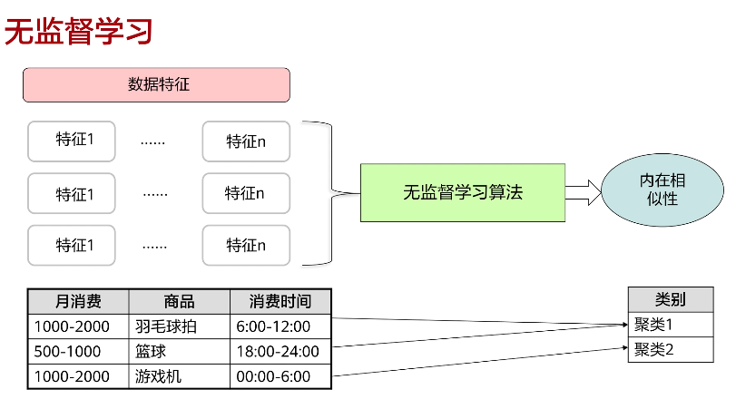

# 机器学习简介

 ## 概念

  - AI，机器学习，深度学习
  
     

  - 算法

    

 ## 发展阶段

   

 ## 按学习分类

  - 有监督学习
  
    > 利用已知类别的样本，训练学习得到一个最优模型，使其达到所要求性能，再利用这个训练所得模型，将所有的输入映射为相应的输出，对输出进行简单的判断，从而实现分类的目的，即可以对未知数据进行分类

     

    ### 监督学习主要的两种类型算法是回归算法和分类算法

     #### 回归算法

      - 回归用于预测输入变量和输出变量之间的关系，即回归模型是表示输入变量到输出变量之间映射的函数
      - 回归问题的学习等价于函数拟合：使用一条函数曲线，使其很好的拟合已知函数且很好地预测未知数据
      - 回归问题分为模型的学习和预测两个过程。基于给定的训练数据集构建一个模型，根据新的输入数据预测相应的输出。且预测值是连续的，即连续的输出值
     - 回归问题按照输入变量的个数可以分为一元回归和多元回归；按照输入变量和输出变量之间关系的类型，可以分为：
        - 线性回归 

          ```
          y = wx + b
          ```

          ```
          y = 5x + 2
          ```

          

        - 非线性回归
  
          ```
          y = wx**2 + b
          y = w1x1 + w2x2 + w3x3 + b
          ```

          ```
          y = 5x**2 + 3x + 2
          ```

          

          ```
          y = 5x**3+ 3x**2 - x + 2
          ```

          

          ```
          y = 5m + 2n + 2
          ```

          

          ```
          y = m**4 + n**4
          ```

          

     
     #### 分类算法

      - 分类算法是通过构造一个分类函数或分类器的方法把数据库中的数据项映射到给定类别中的某一个，从而可以用于预测未知数据
      - 通常根据数据情况将分类问题分为线性可分和线性不可分 

  - 无监督学习
  
    > 对于没有标记的样本，学习算法直接对输入数据集进行建模，例如聚类，即“物以类聚，人以群分”。我们只需要把相似度高的东西放在一起，对于新来的样本，计算相似度后，按照相似程度进行归类

    

  - 半监督学习

    > 试图让学习器自动地对大量未标记数据进行利用以辅助少量有标记数据进行学习。

    

  - 强化学习
  
    > 学习系统从环境到行为映射的学习，以使奖励信号（强化信号）函数值最大，强化学习不同于连接主义学习中的监督学习，主要表现在教师信号上，强化学习中由环境提供的强化信号是对产生动作的好坏作一种评价（通常为标量信号），而不是告诉强化学习系统如何去产生正确的动作

    


 ## 按学习分类 

  - 传统机器学习：适用于结构化数据（规整的表格型数据），适用于需要进行预测的场景（预测类别型结果、数值型结果）：信用风险检测（预测类别）、销售预测（预测金融）、用户画像（预测类别）、商品推荐（预测类别、预测评分）等等。模型可解释性强
  - 深度学习：适用于非结构化数据。例如图像、语音等。适用于识别场景：图像识别、语音识别、语音合成、语义识别。模型的可解释性弱
  - 强化学习：适用于需要探索和优化的场景，不一定需要结构化的数据，对于模拟环境的准确度有强要求，能够根据环境中参数的变化自动给出最优选择：制造业某种设备运行时参数自动调控、智能温控、智能污水处理、智能交通信号灯、Alpha Go围棋

# Python

 ## 安装 

  - 安装虚拟环境 

    > 官网安装地址  
    > https://docs.anaconda.com/free/miniconda/index.html 

  - conda 使用

    > 官方文档  
    > https://docs.conda.io/  
    > https://docs.conda.io/projects/conda/en/latest/user-guide/getting-started.html

  - 创建虚拟环境 

    ```shell
      # conda create --name 虚拟环境名称 python=版本号
      conda create --name ai_learn python=3.9
    ```

  - 列出所有虚拟环境

    ```shell
      conda info --envs
    ```
  
  - 激活/切换虚拟环境

    ```shell
      # conda activate 虚拟环境名称
      conda activate ai_learn 
    ```
  - 推出虚拟环境

    ```shell
      # conda deactivate 虚拟环境名称
      conda deactivate ai_learn 
    ```

  - 安装python library (包或库)

    ```shell
      conda install 包名
      or
      pip install 包名
      # 临时换清华的源
      pip install 包名  -i https://pypi.tuna.tsinghua.edu.cn/simple
    ```

  - 其他命令 

    > 其他命令官网地址  
    > https://docs.conda.io/projects/conda/en/latest/commands/index.html

  - 安装JupyterLab

    ```shell
      pip install jupyterlab
    ```

  - 启动JupyterLab

    ```shell
      # 切换到conda的虚拟环境 
      jupyter lab
    ```

  - 后面会涉及的库(可以提前安装)

    ```shell

      pip install numpy
      pip install matplotlib

    ```
 
 ## 类型

  > Python中常见的数据结构有六种：Number（数值）、String（字符串）、List（列表）、Tuple（元组）、Dictionary（字典）、Set（集合）。这些数据类型不仅可以提高Python的运行效率，还极大地提高了我们的开发效率。并且它们让Python的操作变得简单便捷

 ## 变量

  ### 赋值和打印

   ```python
    msg = "hello world"

    print('msg',msg)
   ```

  ### 变量的命名和使用

   - 变量名只能包含字母、数字和下划线。能以字母或下划线打头，不能以数字打头。
   - 变量名不能包含空格
   - 不要将关键字和函数名用作变量名，如print
   - python3中 Unicode字符或中文也支持，但不推荐
   - 变量名对大小写敏感，现阶段推荐小写，因为大写的变量一般有其他含义

  ### 同时给多个变量赋值

   ```
    x, y, z = 0, 0, 0
   ```
  
  ### 字符串

   - 单引号双引号

   - 首字母大写

      ```python

        msg = "hello world"
        print(msg.title())  # Hello World

      ```

   - 大小写

      ```python

        msg = "hello world" 
        print(msg.upper())  # HELLO WORLD
        print(msg.lower())  # hello world

      ```

   - 模板字符串/格式化字符串

      ```python

        a = "hello"
        b = "world"
        print(f"{a} {b}")  # hello world
        print(f'{a} {b}')  # hello world

      ```

   - 制表符(tab)，换行符

      ```python
        msg = "hello\tworld"
        print(msg)  # hello    world

        line = "hello\nworld"
        print(line)

        # hello
        # world

        print("languages:\n\tpython\n\tjavascript\n\tC")
        #
        # languages:
        #    python
        #    javascript
        #    C
        # #
      ```

   - 删除空白

      ```python
        msg = "  hello  world  "

        print(msg.strip())   # hello  world
        print(msg.lstrip())  # hello  world
        print(msg.rstrip())  #  hello  world
      ```

   - 删除前缀 后缀

      ```python
        url = "https://baidu.com"
        print(url.removeprefix("https://"))
        tmp = url.removeprefix("https://")
        print(tmp.removesuffix(".com")) # baidu

      ```

   - 获取字符串中的字符元素
    
     > 因为字符串是个有序序列，所以我们在访问字符串中的某些元素时可以根据元素对应的下标（索引）来访问：str[n]、正向访问时下标从0开始，到n-1。逆向访问时从-1开始，每次递减一

     > 批量获取（切片）  
     > str[a:b:c]，a是起始元素的位置，b是终止元素的位置，c是步长
     
   - 拼接
     
     > +：字符串相加会得到一个由两个字符串组成的新字符串，"a"+"b"=>"ab"   
     > \*：字符串乘以一个数字可以得到重复次数的新的字符串，"a"*2=>"aa"  
     > str.join(iter)：将所给参数中的每个元素以指定的字符连接生成一个新的字符串

     ```python
     str = ","
     str.join([i for i in "hello"])
     ```
   - 替换
    
     > str.replace(str1,str2)：将字符串中的str1替换为str2生成新的字符串：

     ```python
      'python'.replace('py','PY')
      #输出'PYthon
     ```

   - 切割
 
     > str.split(str1)：以str1为分隔符对字符串切割：
     
     ```python
     'python' .split('h')
     #输出['pyt', 'on']
     ```

  
  ### 常量

   > 常量（constant）是在程序的整个⽣命周期内都保持不变的变量。Python 没有内置的常量类型，但 Python 程序员会使⽤全⼤写字⺟来指出应将某个变量视为常量，其值应始终不变：

   ```python
   MYSQL_URL = "http://localhost:3306/xxx"
   ```

 ## 数 

  ### 整数简单计算

  ```python
  
  print(1+2)
  print(1-2)
  print(1*2)
  print(1/2)
  print(2**3) # 幂运算
  print(2+3*3) # 多项式运算
  
  ```

  ### 浮点数精度损失

  ```python

  print(0.1+0.2) # 0.30000000000004    

  ```

  ### 整数和浮点

   - 将任意两个数相除，结果总是浮点数，即便这两个数都是整数且能整除
   - 在其他任何运算中，如果⼀个操作数是整数，另⼀个操作数是浮点数，结果也总是浮点数，即便结果原本为整数
 
 ## 注释

  > 在 Python 中，注释⽤井号（#）标识。井号后⾯的内容都会被 Python 解释器忽略，如下所⽰：  

  ```python
    # 向⼤家问好
    print("Hello Python people!")
  ```

 ## 列表

  > 列表（list）由⼀系列按特定顺序排列的元素组成。你不仅可以创建包含字⺟表中所有字⺟、数字 0〜9 或所有家庭成员姓名的列表，还可以将任何东⻄加⼊列表，其中的元素之间可以没有任何关系。列表通常包含多个元素，因此给列表指定⼀个表⽰复数的名称（如 letters、digits 或names）是个不错的主意。  

  ```python
  
  letters = ['a','b','c']

  print(letters)

  ```
 ### 访问列表元素

  ```python
  
    letters = ['a','b','c']

    print(letters[0])
    print(letters[1])
    print(letters[2])

    print(letters[-1])
    print(letters[-2])

    msg = f"letter upper is {letters[0].upper()},{letters[1].upper()}"
    print(msg)

  ```
 
 ### 修改、添加和删除元素

  - 修改列表元素

    ```python
    letters = ['a','b','c']

    print(letters)

    letters[0] = 'apple'

    print(letters)
    ```

  - 添在列表中添加元素append

    ```python
    letters = ['a','b','c']
    print(letters)

    letters.append('d')

    print(letters)

    ```

  - 添在列表中添加元素insert

    ```python
    letters = ['a','b','c']
    print(letters)

    letters.insert(0,'d')

    print(letters)  # d,a,b,c

    ```

  - 删除列表中的元素del

    ```python
    letters = ['a','b','c']
    print(letters)

    del letters[0]
    print(letters)
    ```

  - 删除列表中的元素pop

    ```python
    letters = ['a','b','c']
    print(letters)

    delitem = letters.pop()
    print(delitem)  # c
    print(letters)  # a,b


    deltarget = letters.pop(0)
    print(deltarget)  # a
    print(letters)  # b
    ```

  - 根据值删除元素remove

    ```python
    letters = ['a','b','c']
    print(letters)

    letters.remove("b")
    print(letters)  # a,c
    ```

    > remove() ⽅法只删除第⼀个指定的值。
  
  - extend将可迭代对象的每个元素逐个插入列表的尾部

    ```python

      letters = ["a","b"]
      letters.extend(["c","d","e"])
      print(letters)
    ```

 ### 管理列表

  - 使⽤ sort() ⽅法对列表进⾏永久排序

    ```python
    
    letters = ['bb','ba','ac']

    letters.sort()

    print(letters)

    letters.sort(reverse=True)

    print(letters)
    ```

  - 使⽤ sorted() 函数对列表进⾏临时排序

    ```python

    letters = ['b','a','c']

    print(sorted(letters))

    print(letters)

    print( sorted(letters,reverse=True))

    print(letters)
    ```

  - 反向打印列表
    
    ```python   
    
    letters = ['b','a','c']

    letters.reverse()

    print(letters)
    
    ```
  
  - 列表的⻓度
    
    ```python
    letters = ['b','a','c']
    print(len(letters))
    ```
  - 数量统计：

    > list.count(obj)：返回给定元素出现的次数


    ```python
    ['a', 'b', 'a', 'b', 'a', 'b'].count("b")
    # 3
    ```

  - 位置查找
  
    返回给定元素第一次出现位置的下标

    ```python
    ['a', 'b', 'a', 'b', 'a', 'b'].index("b")
    # 1
    ```
 
 ## 遍历

  ```python
    letters = ['a','b','c']
    for item in letters:
      print(item)

    for v in letters:
      print(f'大写： {v.upper()}')
  ```

  ### enumerate 方法

   > enumerate 是一种特殊的打包，它可以在迭代时绑定迭代元素的遍历序号：

   ```python

    In [22]: L = list('abcd')
    In [23]: for index, value in enumerate(L):
       ....:    print(index, value)
       ....:
    0 a
    1 b
    2 c
    3 d

   ```

 ## 创建数值列表

  ```python

    for v in range(1,5):
      print(v)

    # range(1,5)  [1,5)
    # 1,2,3,4,  
  ```

 ## 使⽤ range() 创建数值列表

  ```python

    nums = list(range(1,6))

    print(nums) # [1,2,3,4,5]

    even_nums = list(range(2,11,2))

    print(even_nums) # [2,4,6,8,10]

    squares = []

    for v in range(1,11):
      squares.append(v**2)

    print(squares) # [1,4,9,16,25,36,49,64,81,100]
  ```
 
 ## 对数值列表执⾏简单的统计计算

  ```python

    nums = [1,2,3,4,5]

    print(f'列表最小值： {min(nums)}')

    print(f'列表最大值： {max(nums)}')

    print(f'列表总和： {sum(nums)}')

  ```

 ## 列表推导式

  ```python
  In [1]: L = []
  In [2]: def my_func(x):
  ...:      return 2*x
  ...:
  In [3]: for i in range(5):
  ...:      L.append(my_func(i))
  ...:
  In [4]: L
  Out[4]: [0, 2, 4, 6, 8]
  ```

  > 事实上可以利用列表推导式进行写法上的简化：[* for i in *] 。其中，第一个 * 为映射函数，其输入为后面 i 指代的内容，第二个 * 表示迭代的对象。

  ```python
  In [5]: [my_func(i) for i in range(5)]
  Out[5]: [0, 2, 4, 6, 8]
  ```

  ```python

    squares = [v**2 for v in range(1,11)]

    print(squares)
  
  ```

  > 列表表达式还支持多层嵌套，如下面的例子中第一个 for 为外层循环，第二个为内层循环

  ```python
  In [6]: [m+'_'+n for m in ['a', 'b'] for n in ['c', 'd']]
  Out[6]: ['a_c', 'a_d', 'b_c', 'b_d']
  ```

 ## 列表切片

  ```python

    letters = ['a','b','c','d','e','f','g']

    print(letters[1:3]) # ['b','c']   [1,3） index: 1 2

    print(len(letters)) # 7

    print(letters[5:7]) # ['f','g']   [5,7） index: 5 6

    print(letters[:4]) # ['a','b','c','d']   [0,4） index: 0 1 2 3

    print(letters[2:]) # ['c','d','e','f','g']   [2,7） index: 2 3 4 5 6

    print(letters[:]) # ['a','b','c','d','e','f','g']   [0,7）

    print(letters[-3:]) # 最后三个元素 ['e','f','g']   [-3,7） index: 4 5 6

    print(letters[::2]) # ['a','c','e','g']   [0,7） index: 0 2 4  step 2

    print(letters[::-1]) # ['g','f','e','d','c','b','a']   倒叙

  ```

 ## 遍历切片

  ```python

    letters = ['a','b','c','d','e','f','g']

    for letter in letters[:3]:
      print("遍历前三个",letter)
  
  ```

 ## 复制列表

  ```python

    letters1 = ['a','b','c']

    letters2 = letters1

    print(letters1 == letters2)

    letters1[1] = '100'

    print(letters1,letters2)

    letters_copy = letters1[:]

    print(letters_copy == letters1)

    letters1[1] = '200'

    print(letters1,letters2,letters_copy)

    # https://pythontutor.com/
  
  ```
 
 ## 元组tuple

  > 列表可以修改，元组不可以修改的列表  

  ### 定义元组

  ```python

    dimensions = (200,50)

    print(dimensions[0])
    print(dimensions[1])

    dimensions[0] = 300


    t1 = (3,)

    t2 = 2,  # 可以但不推荐

    # 严格地说，元组是由逗号标识的，圆括号只是让元组看起来更整洁，更清晰。
    # 如果你要定义一个元素的元组，必须在这个元素后面加上逗号
            
  ```

  ### 遍历元组中的所有值

  ```python

    dimensions = (200,50)

    for dim in dimensions:
        print(dim)

  ```

  ### 修改元组变量

  ```python
    dimensions = (200,50)   

    print(dimensions)

    dimensions = (300,50)  # 修改元组变量

    print(dimensions)
  ``` 


 ## 设置代码格式

  - 缩进

    PEP8 建议每级使用4个空格

    常常使用制表符(tab)而不是按4次空格来缩进，但是不同文本编辑器的tab长度可能不同，所以使用4个空格缩进更通用，但繁琐。

    这里的建议是先使用tab，如果不行，可以按4个空格，或是在该文本编辑器中设置tab为长度是4的空格。

  - 行长

    PEP8 建议每行最多79个字符，但有些情况下，比如长字符串，可以超过79个字符。


 ## if语句 

  ### 语法示例

  ```python

    letters = ['aaa','bbb','ccc']

    for v in letters：
        if v == 'a':
            print(v.upper())
        else:
            print(v.title())
    
  ```

  ### 条件测试

  - 检查是否相等

    ```python
    
        car = "honda"

        print(car == "honda")  # True
        print(car == "bmw")    # False
    
    ```
 
  - 检查是否不相等
    
    ```python

        msg = "hello"

        if msg != "Hello":
            print(f"msg 不是 Hello")
    
    ```   

  - 小于，小于等于，大于，大于等于 

    ```python

        num = 10

        print(num < 20) # True
        print(num <= 20) #True
        print(num > 20) #False
        print(num >= 20) #False

    ```
 
  - 使用and检查多个条件 

    ```python

        num1 = 22
        num2 = 18

        print(num1 > 21 and num2 >= 21) # False
        print(num1 > 21 and num2 < 21) #  True

    ```
  
  - 使用or检查多个条件 

    ```python

        num1 = 22
        num2 = 18

        print(num1 < 21 or num2 >= 21) # False
        print(num1 > 21 or num2 >= 21)  # True

    ```

  - 检查特定的值是否在列表中

    ```python

        fruits = ["apple", "banana", "cherry"]
        print("banana" in fruits) # True

        print("orange" in fruits) # False
    
    ```

  - 检查特定的值是否不在列表中

    ```python

        fruits = ["apple", "banana", "cherry"]
        print("banana" not in fruits) # False

        print("orange" not in fruits) # True
    
    ```

  ### if语句 

  - 简单的if语句 

    ```python

        if conditional_test:
            do something

    ```

  - 简单的if-else语句 

    ```python

        if conditional_test:    
            do something
        else:
            do something 
    
    ```

  - 简单的if-elif-else语句 

    ```python

        if conditional_test:
            do something
        elif: 
            do something
        else:
            do something 
    
    ```

  - 省略else代码块

    ```python

        if conditional_test1:
            do something
        elif conditional_test2:
            do something
        elif conditional_test3:
            do something
        elif conditional_test4:
            do something
        elif conditional_test5:
            do something
    
    ```

  - 测试多个条件

    > if-elif-else 相当于短路逻辑，符合一个条件后，其他条件就不再判断了  
    > 因此，如果使用多个条件判断，可以使用多个简单的if语句

    ```python

        letters = ['A','B','C']

        if 'A' in letters:
            print("A exists list" )
        if 'B' in letters:
            print("B exists list" )
        if 'C' in letters:
            print("C exists list" )

    ```

  ### 确定列表非空

  > if语句判断列表时，将列表至少包含一个元素时返回True，为空时返回False  
  > if 对于数值0，空值None, '',"",[],空元组(),空字典 均返回False

  ```python
    
    arr = []

    if arr:
        print("arr is not empty")
    else:
        print("arr is empty")

  ```
 
  ### 条件赋值

   ```python
    In [7]: value = 'cat' if 2>1 else 'dog'
    In [8]: value
    Out[8]: 'cat'
   ```

   > 等价于如下的写法：

   ```python
    a, b = 'cat', 'dog'
    condition = 2 > 1 # 此时为 True
    if condition:
      value = a
    else:
      value = b
   ```

   > 和列表推导联合

   ```python

    In [9]: L = [1, 2, 3, 4, 5, 6, 7]
    In [10]: [i if i <= 5 else 5 for i in L]
    Out[10]: [1, 2, 3, 4, 5, 5, 5]

   ```

 ## 字典
  
  ### 声明

  > d1 = {key:value,}  
  > d2 = dict(key=value,)  
  > d3 = dict([(key,value),])

  ```python
   d1 = {"a":1,"b":2}
   d2 = dict(a=1,b=2)
   d3 = dict([("a",1),("b":2)])
  ```

  ### 一个简单的字典

  ```python

    stu = {'name':'john','score':100,'grade':'primary'}

    print(stu)

    print(stu['name'])
    print(stu['score'])

  ```

  ### 获取元素
  
   - dict.get(key,default=None)/dict[key]：获取key对应的value，前者在访问不存在的key时不会报错，会返回设置的默认值（default）
   - dict.items()：返回一个包含所有（键，值）元组的列表
   - dict.keys()：返回一个包含字典所有key的列表
   - dict.values()：返回一个包含字典所有value的列表

  ### 使用字典

  > 字典（dictionary）是⼀系列键值对。在 Python 中，字典⽤放在花括号（{}）中的⼀系列键值对表⽰  

  - 访问

    ```python
    
    stu = {'name':'john','score':100,'grade':'primary'}

    print(stu['name'])
    
    ```

  - 添加键值对

    ```python
    
    stu = {'name':'john','score':100,}

    stu['grade'] = 'primary'
    stu['x'] = 100

    print(stu)

    ```

  > 字典会保留定义时的元素排列顺序。如果将字典打印出来或遍历其元素，将发现元素的排列顺序与其添加顺序相同。  

  - 从创建⼀个空字典开始

    ```python
    
      obj = {}

      obj['x'] = 1
      obj['y'] = 2
      print(obj)

    ```

  - 修改字典中的值

    ```python
    
      obj = {'x':1,'y':2}

      obj['x'] = 100

      print(obj)
    
    ```

  - 删除键值对

    ```python
    
      obj = {'x':1,'y':2}

      del obj['x']

      print(obj)
    
    ```

  - 使⽤ get() 来访问值

    ```python

      obj = {'x':1,'y':2}


      print(obj['z'])  # 键不存在，会抛出异常

      print(obj.get('z'))  # 键不存在，返回 None，不会抛异常

      print(obj.get('z',-100))  # 键不存在，返回默认值 -100
  
    ```
    > 注意：在调⽤ get() 时，如果没有指定第⼆个参数且指定的键不存在，Python 将返回值 None，这个特殊的值表⽰没有相应的值。这并⾮错误，None 只是⼀个表⽰所需值不存在的特殊值

  
  ### 遍历字典

  > 有多种遍历⽅式：既可遍历字典的所有键值对，也可只遍历键或值。  

  - 遍历所有的键值对

    ```python
    
      obj = {'x':1,'y':2}

      for k,v in obj.items():
        print(f"key is {k},value is {v}") 
    
      favorite_lang = {
        'jen':'python',
        'sarah':'c',
        'edward':'java',
        'phil':'python'
        }

      for name,lang in favorite_lang.items():
        print(f"{name.title()}'s favorite language is {lang.title()}")

    ```

  - 遍历字典中的键  

    ```python

      favorite_lang = {
        'jen':'python',
        'sarah':'c',
        'edward':'java',
        'phil':'python'
      }

      for name in favorite_lang.keys():
        print(name.title())

      for name in favorite_lang:
        print(name.title())
  
    ```
  
  - 遍历字典中的值

    ```python

      favorite_lang = {
        'jen':'python',
        'sarah':'c',
        'edward':'java',
        'phil':'python'
      }

      for lang in favorite_lang.values():
        print(lang.title())

    ```

  - 更新：
   
    > dict.update(dict1)：使用dict1来对字典进行更新

  - 删除：
   
    > dict.pop(key)：删除并返回key对应的值  
    > dict.popitem()：随机删除并返回一个键值对  
    > dict.clear()：清空字典

  ### 嵌套 

  - 字典列表 

    ```python

      # 字典列表

      stu1 = {
        'name':'zhang',
        'score':100,
      }

      stu2 = {
        'name':'li',
        'score':70,
      }

      stu3 = {
        'name':'wang',
        'score':80,
      }

      stu_list = [stu1,stu2,stu3]

      for stu in stu_list:
        print(stu)

    ```
  - 字典嵌套列表

    ```python

      # 字典嵌套列表

      stu1 = {
        'name':'zhang',
        'score':[100,90,80], 
      }

    ```

  - 字典中嵌套字典

    ```python

      # 字典中嵌套字典

      stu1 = {
        'name':'zhang',
        'score':[100,90,80], 
        'info':{
          'hobby':['basketball','football','pingpang'],
          'age':20,
          'sex':'male'
        }
      }
    
    ```

 ## 集合 set

  > 集合（set）是一个无序不重复元素的序列。可以消除重复元素。  
  > 集合中的元素是唯一的，重复的元素会被删除  
  > 集合是由一个花括号包裹，内部元素以逗号隔开。声明一个集合的方式有：  
  >  Set = set()  
  >  Set = {obj1,obj2,…}


  ```python

      # 创建集合set

      s = {'a','b','c','a'}

      print(s)  #  {a,b,c}

      favorite_lang = {
        'jen':'python',
        'sarah':'c',
        'edward':'java',
        'phil':'python'
      }

      for lang in set(favorite_lang.values()):
        print(lang)
    
  ```

  - 添加

    > set.add(obj)：如果元素已存在，则不会进行任何操作，返回false  
    > set.update(obj)：添加对象可以是列表，字典等，且可以是多个，用逗号隔开
 
  - 删除

    > set.remove(obj)/set.discard(obj)：如果删除元素不存在，前者会报错  
    > set.clear()：清空集合  
    > set.pop()：随机删除一个元素

   
  - 逻辑运算

    > 交集set1 & set2：两个集合中相同的元素  
    > 对称差集set1 ^ set2：两个集合中不同的元素  
    > 并集set1 | set 2：两个集合内总共的元素（重复的删除）  
    > 差集set1 - set 2：集合二相比集合一中不存在的元素  

    ```python

    s1 = {"a","b"}
    s2 = {"b","c"}
    s3 = s1 - s2
    print(s3)

    ```

  - 不可变集合
  
    > frozenset()：不可被改变的集合
  
 ## 用户输入和while循环

  ### input()函数的工作原理  

  > input() 函数让程序暂停运⾏，等待⽤户输⼊⼀些⽂本。获取⽤户输⼊后，Python 将其赋给⼀个变量，以便使⽤。 
  
  ```python

    message = input("Tell me something, and I will repeat it back to you: ")
    print(message)

  ```

  > input() 函数接受⼀个参数，即要向⽤户显⽰的提⽰（prompt），让⽤户知道该输⼊什么样的信息。在这个⽰例中，当 Python 运⾏第⼀⾏代码时，⽤户将看到提⽰“Tell me something, and I will repeat it back to you:”。程序等待⽤户输⼊，并在⽤户按回⻋键后继续运⾏。⽤户的输⼊被赋给变量message，接下来的 print(message) 将输⼊呈现给⽤户.  

  > 注意：input() 函数返回的数据类型是字符串，即使你输⼊的是数字。
  
  - 使⽤ int() 来获取数值输⼊

    ```python

      # 使⽤ int() 来获取数值输⼊

      message = input("Tell me something, and I will repeat it back to you: ")
      print(message)
      print(type(message))  # str

      message = int(message)
      print(message)
      print(type(message))

    ```

  - 求模运算符 

    ```python
      # 求模运算符

      number = input("Enter a number, and I'll tell you if it's even or odd:")
      number = int(number)

      if number % 2 == 0:
        print(f"\nThe number {number} is even.")
      else:
        print("\n" + str(number) + " is odd.")

    ```


  ### while循环

  > for 循环⽤于针对集合中的每个元素执⾏⼀个代码块，⽽ while 循环则不断地运⾏，直到指定的条件不再满⾜为⽌。

  ```python

   # 使⽤ while 循环计算 1 到 100 的总和

    sum = 0
    i = 1
    while i <= 5:
      sum += i
      i += 1

    print(sum) 

  ```

  > Python语言中while语句用于执行循环程序，在某条件下，循环执行某段程序，以处理需要重复处理的相同任务  
  > 当while语句的条件永远为真时，循环将永远不会结束，形成无限循环，也称死循环。  
  > 可以在while后面加入else语句块，在条件为假时执行（可以不加else）  
  > 在使用while循环时尽量避免空循环，会浪费资源  
  > while语句的用法：  

  ```python
    while 条件语句:
      循环执行的语句块 # 条件为真时执行
    else:
      语句块 # 条件为假时执行

    count = 3
    while count > 0:
        count -= 1
        print(count)
    else:
        print("count",count)
  
  ```

  - while和input搭配,实现简单cli

    ```python

      # while和input搭配
      prompt = "\nTell me something, and I will repeat it back to you:"
      prompt += "\nEnter 'quit' to end the program. "

      message = ""
      while message != 'quit':
        message = input(prompt)
        if message != 'quit':
          print(message)

    ```

  - 使⽤标志flag变量来控制循环

    ```python

      # 使⽤标志变量来控制循环
      prompt = "\nTell me something, and I will repeat it back to you:"
      prompt += "\nEnter 'quit' to end the program. "
      active = True
      while active:
        message = input(prompt)
        if message == 'quit':
          active = False
        else:
          print(message)

    ```

  - 使⽤ break 退出循环

    ```python

      # 使⽤ break 退出循环

      prompt = "\nPlease enter the name of a city you have visited:"
      prompt += "\n(Enter 'quit' when you are finished.) "
      while True:
        city = input(prompt)
        if city == 'quit':
          break
        else:
          print(f"I'd love to go to {city.title()}!")

    ```

     > 注意：在所有 Python 循环中都可使⽤ break 语句。例如，可使⽤break 语句来退出遍历列表或字典的 for 循环。

  - 使⽤ continue 语句来跳过当前循环中的剩余代码，然后继续进行下一轮循环。

    > 要返回循环开头，并根据条件测试的结果决定是否继续执⾏循环，可使⽤continue 语句，它不像 break 语句那样不再执⾏余下的代码并退出整个循环。例如，来看⼀个从 1 数到 10，只打印其中奇数的循环：

    ```python
      # 使⽤ continue 语句来跳过当前循环中的剩余代码，然后继续进行

      curr_num = 0
      while curr_num < 10:
        curr_num += 1
        if curr_num % 2 == 0:
          continue

        print(curr_num)  # 只打印其中奇数 1 3 5 7 9


    ```
  
  - 避免⽆限循环

    > 编写循环时，要特别注意不要让它变成无限循环，这会导致程序卡死。

    ```python

      x = 1
      while x <= 5:
        print(x)
        # x += 1  # 这行没写，这个循环将没完没了地运⾏ 

    ```

  ### 使⽤ while 循环处理列表和字典

  - 使⽤ while 循环来遍历列表和字典 

    ```python

      unconfirmed_users = ['a', 'b', 'c']
      confirmed_users = []

      # 遍历列表，获取每个用户名，并提示用户确认
      while unconfirmed_users:
        current_user = unconfirmed_users.pop()

        print(f"Verifying user: {current_user.title()}")

        confirmed_users.append(current_user)

      print("\nThe following users have been confirmed:")
      for u in confirmed_users:
        print(u.title())

    ```

  - 删除为特定值的所有列表元素 

    ```python

      pets = ['dog', 'cat', 'dog', 'goldfish', 'cat', 'rabbit', 'cat']
      print(pets)
      while 'cat' in pets:
        pets.remove('cat')
      print(pets)

      # 也可以使用set

      without_cat = set(pets)

      print(without_cat)
    
    ```

  - 使⽤⽤户输⼊填充字典

    ```python

      responses = {}
      # 声明一个flag，表示是否继续
      polling_active = True

      while polling_active:
        name = input("\nWhat is your name? ")
        response = input("Which pet do you like best? ")

        responses[name] = response

        repeat = input("Would you like to let another person respond? (y/n) ")
        if repeat == 'n':
          polling_active = False

      print("\n--- Poll Results ---")

      for name,resp in responses.items():
        print(f"{name} like {resp}")
    
    ```
 
  ### 循环终止 - break和continue

   - 在循环进行时，如果我们需要打断循环可以使用break和continue来实现
   - break语句结束整个循环。如果触发了break，则当前循环终止，循环对应的else也不会执行
   - 如果在嵌套循环中使用break语句，将停止执行break所在的那一层循环，并开始执行下一行代码
   - continue语句用来告诉Python跳过当前循环的剩余语句，然后继续进行下一轮循环
   - break和continue语句都可用在while和for循环中
 
 ## 函数

  ### 定义函数

  ```python

    #声明
    def greet_user():
      print("Hello!")

    #调用
    greet_user()

  ```

  - 传参

    ```python
      def greet_user(username):
        print(f"hello,{username.title()}")

      greet_user("jerry")
    
    ```

  - 实参和形参

    > 实参是argument  
    > 形参是parameter  

    ```python

      def greet_user(username): # 这里的username是形参
        print(f"hello,{username.title()}")

      greet_user("jerry") # 这里是实参

    ```

  ### 参数 
  
  - 多个参数和参数顺序

    ```python

      def func(p1,p2,p3):
        print(f"p1:{p1},p2:{p2},p3:{p3}")

      func(1,2,3)    # p1 1,p2 2,p3 3
      func(30,20,10) # p1 30, p2 20, p3 10

    ```

  - 关键字实参

    > 关键字实参的顺序⽆关紧要，因为 Python 知道各个值该被赋给哪个形参。下⾯两个函数调⽤是等效的  

    ```python

      def func(p1,p2,p3):
        print(f"p1:{p1},p2:{p2},p3:{p3}")

      func(p3=3,p1=1,p2=2) # p1 1,p2 2,p3 3

    ```

    > 注意：在使⽤关键字实参时，务必准确地指定函数定义中的形参名。  
    > 在给形参指定默认值时，等号两边不要有空格  

  - 默认值

    ```python

      def func(p1,p2,p3=0):
        print(f"p1:{p1},p2:{p2},p3:{p3}") 

      func(1,2) # p1 1,p2 2,p3 0
    
    ```

    > 注意：当使⽤默认值时，必须在形参列表中先列出没有默认值的形参，再列出有默认值的形参。这让 Python 依然能够正确地解读位置实参。 

  - 等效的函数调用

    ```python

      def describe_pet(pet_name, animal_type='dog'):
        do sth

      # ⼀条名为 Willie 的⼩狗
      describe_pet('willie')
      describe_pet(pet_name='willie')
      # ⼀只名为 Harry 的仓⿏
      describe_pet('harry', 'hamster')
      describe_pet(pet_name='harry', animal_type='hamster')
      describe_pet(animal_type='hamster', pet_name='harry')
    
    ```
 
  ### 返回值 

   - 函数可以根据返回值分为有返回值函数和无返回值函数  
   - 无返回值   
     > 函数体中没有return，函数返回None值
   - 有返回值：
     > 函数体中有return语句，并且返回了相应的表达式或者数值
   - Python中函数可以有多个返回值（不是return多次，是一个return后跟多个返回值），默认以元组的形式返回

  - 简单例子

    ```python

      def get_formatted_name(first_name, last_name, middle_name=''):
        """返回标准格式的姓名"""
        if middle_name:
          full_name = f"{first_name} {middle_name} {last_name}"
        else:
          full_name = f"{first_name} {last_name}"

        return full_name.title()

      musician = get_formatted_name('jimi', 'hendrix')
      print(musician)
      musician = get_formatted_name('john', 'hooker', 'lee')
      print(musician)

    ```

  - 返回字典

    ```python

      def build_person(first_name, last_name,score=None):
        """返回⼀个字典，其中包含⼀个人的姓名"""
        person = {'first': first_name, 'last': last_name}
        if score:
          person['score'] = score
        return person

      musician = build_person('jimi', 'hendrix',score=80)
      
      print(musician)
    
    ```

  - 结合使用函数和while循环

    ```python

      def get_formatted_name(first_name, last_name):
          """返回规范格式的姓名"""
          full_name = f"{first_name} {last_name}"
          return full_name.title()

      # 这是⼀个⽆限循环！
      while True:
          print("\nPlease tell me your name:")
          print("(enter 'q' at any time to quit)")

          f_name = input("First name: ")
          if f_name == 'q':
              print('bye')
              break
          l_name = input("Last name: ")
          if f_name == 'q':
              print('bye')
              break

          formatted_name = get_formatted_name(f_name, l_name)
          print(f"\nHello, {formatted_name}!")
    
    ```

  ### 传递列表

   - 在函数中修改列表 

     ```python

      def add(letters):
        letters.append(".")
      
      letters = ["a", "b", "c"]
      add(letters)
      print(letters)
    
     ```

     ```python
      def print_models(unprinted_designs, completed_models):
        """
        模拟打印每个设计，直到没有未打印的设计为⽌
        打印每个设计后，都将其移到列表 completed_models 中
        """
        while unprinted_designs:
          current_design = unprinted_designs.pop()
          print(f"Printing model: {current_design}")
          completed_models.append(current_design)
      
      def show_completed_models(completed_models):
        """显⽰打印好的所有模型"""
        print("\nThe following models have been printed:")
        for completed_model in completed_models:
        print(completed_model)
        
        
      unprinted_designs = ['phone case', 'robot pendant', 'dodecahedron']
      completed_models = []
      print_models(unprinted_designs, completed_models)
      show_completed_models(completed_models)

     ```

  - 禁⽌函数修改列表 

    ```python

      def output(msg_list):
          while msg_list:
              print(msg_list.pop())


      letters = ["a", "b", "c"]
      # output(letters)
      output(letters[:])  # 切⽚表⽰法 [:] 创建列表的副本,防止函数修改列表
      print(letters)
    
    ```

    > 虽然向函数传递列表的副本可保留原始列表的内容，但除⾮有充分的理由，否则还是应该将原始列表传递给函数。这是因为，让函数使⽤现成的列表可避免花时间和内存创建副本，从⽽提⾼效率，在处理⼤型列表时尤其如此。

  - 传递任意数量的实参

    ```python

      def make_pizza(*toppings):
        """打印顾客点的所有配料"""
        print(toppings,type(toppings))
        
      make_pizza('pepperoni')
      make_pizza('mushrooms', 'green peppers', 'extra cheese')

    ```

  - 结合使⽤位置实参和任意数量的实参

    > 如果要让函数接受不同类型的实参，必须在函数定义中将接纳任意数量实参的形参放在最后。Python 先匹配位置实参和关键字实参，再将余下的实参都收集到最后⼀个形参中 

    ```python

      def make_pizza(size, *toppings):
        """概述要制作的⽐萨"""
        print(f"\nMaking a {size}-inch pizza with the following toppings:")
        for topping in toppings:
          print(f"- {topping}")

      make_pizza(16, 'pepperoni')
      make_pizza(12, 'mushrooms', 'green peppers', 'extra cheese')
    
    ```

    > 注意：你经常会看到通⽤形参名 *args，它也这样收集任意数量的实参。

  - 使⽤任意数量的关键字实参

    > 有时候，你需要接受任意数量的实参，但预先不知道传递给函数的会是什么样的信息。在这种情况下，可将函数编写成能够接受任意数量的键值对——调⽤语句提供了多少就接受多少。


    ```python

      def build_profile(first, last, **user_info):
        """创建⼀个字典，其中包含我们知道的有关⽤户的⼀切"""
        user_info['first_name'] = first
        user_info['last_name'] = last
        return user_info
        
      user_profile = build_profile('albert', 'einstein',location='princeton',field='physics')

      print(user_profile)
    
    ```

    > 注意：你经常会看到形参名 **kwargs，它⽤于收集任意数量的关键字实参。

  ### 将函数存储在模块中 

  > 使⽤函数的优点之⼀是可将代码块与主程序分离。通过给函数指定描述性名称，能让程序容易理解得多。你还可以更进⼀步，将函数存储在称为模块的独⽴⽂件中，再将模块导⼊（import）主程序。import 语句可让你在当前运⾏的程序⽂件中使⽤模块中的代码。

  - 导⼊整个模块 

    pizza.py

    ```python

      def make_pizza(size, *toppings):
        """概述要制作的⽐萨"""
        print(f"\nMaking a {size}-inch pizza with the following toppings:")
        for topping in toppings:
          print(f"- {topping}")
    
    ```

    making_pizzas.py

    ```python

      import pizza

      pizza.make_pizza(16, 'pepperoni')
      pizza.make_pizza(12, 'mushrooms', 'green peppers', 'extra cheese')
    
    ```
    
    > 当 Python 读取这个⽂件时，代码⾏ import pizza 会让 Python 打开⽂件pizza.py，并将其中的所有函数都复制到这个程序中。你看不到复制代码的过程，因为 Python 会在程序即将运⾏时在幕后复制这些代码。你只需要知道，在 making_pizzas.py 中，可使⽤ pizza.py 中定义的所有函数。  

    ```python


      import module_name

      module_name.function_name()

    ```

  - 导⼊特定的函数
  
    > 还可以只导⼊模块中的特定函数，语法如下：  

    ```python

      from module_name import function_name

    ```

    > ⽤逗号分隔函数名，可根据需要从模块中导⼊任意数量的函数：  

    ```python

      from module_name import function_0, function_1, function_2
    
    ```

    ```python

      from pizza import make_pizza
      make_pizza(16, 'pepperoni')
      make_pizza(12, 'mushrooms', 'green peppers', 'extra cheese')

    ```
  
  - 使⽤ as 指定别名

    ```python

      import module_name as other_name

      from module_name import function_name as fn

    ```

  - 导⼊模块中的所有函数

    ```python

      from module_name import *

    ```

    ```python

      from pizza import *

      make_pizza(16, 'pepperoni')
      make_pizza(12, 'mushrooms', 'green peppers', 'extra cheese')
    
    ```

    > 由于导⼊了每个函数，可通过名称来调⽤每个函数，⽆须使⽤点号（dot notation）。然⽽，在使⽤并⾮⾃⼰编写的⼤型模块时，最好不要使⽤这种导⼊⽅法，因为如果模块中有函数的名称与当前项⽬中既有的名称相同，可能导致意想不到的结果：Python 可能会因为遇到多个名称相同的函数或变量⽽覆盖函数。


 
  ### 匿名函数 lambda

   ```python
    In [11]: my_func = lambda x: 2*x
    In [12]: my_func(3)
    Out[12]: 6
    In [13]: multi_para_func = lambda a, b: a + b
    In [14]: multi_para_func(1, 2)
    Out[14]: 3
   ```

   > 结合列表推导式 

   ```python
    In [15]: [(lambda x: 2*x)(i) for i in range(5)]
    Out[15]: [0, 2, 4, 6, 8]
   ```

   > 对于上述的这种列表推导式的匿名函数映射，Python 中提供了 map 函数来完成，它返回的是一个 map 对象，需要通过 list 转为列表：

   ```python
    In [16]: list(map(lambda x: 2*x, range(5)))
    Out[16]: [0, 2, 4, 6, 8]
   ```

   > 对于多个输入值的函数映射，可以通过追加迭代对象实现：

   ```python
    In [17]: list(map(lambda x, y: str(x)+'_'+y, range(5), list('abcde')))
    Out[17]: ['0_a', '1_b', '2_c', '3_d', '4_e']
   ```

 ## 类 

 > 根据类来创建对象称为实例化，这让你能够使⽤类的实例（instance）  

  ### 创建和使⽤类 

  - 创建 Dog 类 

    ```python


      # 类的名称首字母大写 Dog
      # 这里我们的类是一个全新的类，所以不用加括号

      class Dog:

        # 在类被实例化时，这个方法会自动执行
        # 形参self必不可少，必须放在第一位，类中的其他方法都会自动传递self，比如sit，roll_over
        # self 是一个指向实例本身的引用，让self能访问类中的方法
        # self 这个参数在实例化时不需要我们传递，有python自身传递，这个例子中，我们只需要传name,age就行 
        def __init__(self,name,age):
          self.name = name  # 向实例设置属性name
          self.age = age

        def sit(self):
          print(self.name.title() + " is now sitting.")

        def roll_over(self):
          print(self.name.title() + " rolled over!")


      my_dog = Dog('tom', 6)  # Dog 被实例化，并将实例化的实例对象赋值给my_dog这个变量
      
      # 实例.属性 这里的实例就是之前介绍的self，因为在__init__中添加了两个属性，所以这里我们可以 .name 或者 .age 来获取属性
      print(f"My dog's name is {my_dog.name}.")  
      print(f"My dog's is {my_dog.age} years old.")

    ```
  
  - 调用方法

    ```python

      my_dog.sit()  # 实例.方法()

      my_dog.roll_over() 
    
    ```

  - 创建多个实例 

    ```python

      # 创建多个实例
      my_dog = Dog('Tom', 6)
      your_dog = Dog('Lucy', 3)

      my_dog.sit()
      your_dog.sit()

    ```

  - 每次实例化都是一个新的实例

    ```python

      # 即使两个实例的属性相同，但是实例也是不同的

      d1 = Dog('tom', 6)
      d2 = Dog('tom', 6)  

      print("d1",d1)  # 打印实例在内存中的内存地址
      print("d2",d2)

      print(d1 == d2) # False

    ```
  
  ### 使用类和实例 

  - 声明Car类 

    ```python

      class Car:

        def __init__(self,make,model,year):
          self.make = make
          self.model = model
          self.year = year
        
        def get_descriptive_name(self):
          
          long_name = f"{self.year} {self.make} {self.model}"
          return long_name.title()

      my_new_car = Car('audi', 'a4', 2016)
      print(my_new_car.get_descriptive_name())
    
    ```

  - 给属性指定默认值 

     ```python

      class Car:

        def __init__(self,make,model,year):
          self.make = make
          self.model = model
          self.year = year
          self.odometer_reading = 0
        
        def get_descriptive_name(self):
          
          long_name = f"{self.year} {self.make} {self.model}"
          return long_name.title()

        def read_odometer(self):
          print(f"This car has {self.odometer_reading} miles on it.")


      my_new_car = Car('audi', 'a4', 2016)
      print(my_new_car.get_descriptive_name())
      my_new_car.read_odometer()
    
     ```

  - 修改属性的值 

    > 三种方式修改

    - 直接修改 

      ```python

        my_new_car = Car('audi', 'a4', 2016)
        my_new_car.odometer_reading = 23

        print(my_new_car.read_odometer())
      
      ```

    - 通过方法修改 

      ```python

        class Car:

          def __init__(self,make,model,year):
            self.make = make
            self.model = model
            self.year = year
            self.odometer_reading = 0

          def get_descriptive_name(self):

            long_name = f"{self.year} {self.make} {self.model}"
            return long_name.title()

          def read_odometer(self):
            print(f"This car has {self.odometer_reading} miles on it.")

          def update_odometer(self,mileage):
            if mileage >= self.odometer_reading:
              self.odometer_reading = mileage
            else:
              print("You can't roll back an odometer!")

        my_new_car = Car('audi', 'a4', 2016)
        my_new_car.update_odometer(23)
        print(my_new_car.read_odometer())
   
      ```

    - 通过方法让属性值递增 

      ```python

        class Car:

          def __init__(self,make,model,year):
            self.make = make
            self.model = model
            self.year = year
            self.odometer_reading = 0

          def get_descriptive_name(self):

            long_name = f"{self.year} {self.make} {self.model}"
            return long_name.title()

          def read_odometer(self):
            print(f"This car has {self.odometer_reading} miles on it.")

          def update_odometer(self,mileage):
            if mileage >= self.odometer_reading:
              self.odometer_reading = mileage
            else:
              print("You can't roll back an odometer!")

          def increment_odometer(self,miles):
            self.odometer_reading += miles

        my_new_car = Car('audi', 'a4', 2016)
        my_new_car.update_odometer(23)
        my_new_car.read_odometer()
        my_new_car.increment_odometer(100)
        my_new_car.read_odometer()

      ```

  ### 继承 

  > 如果要编写的类是⼀个既有的类的特殊版本，可使⽤继承（inheritance）。当⼀个类继承另⼀个类时，将⾃动获得后者的所有属性和⽅法。原有的类称为⽗类（parent class），⽽新类称为⼦类（child class）。⼦类不仅继承了⽗类的所有属性和⽅法，还可定义⾃⼰的属性和⽅法。 

  - ⼦类的 \_\_init__() ⽅法

    > 在既有的类的基础上编写新类，通常要调⽤⽗类的 \_\_init__() ⽅法。这将初始化在⽗类的 \_\_init__() ⽅法中定义的所有属性，从⽽让⼦类也可以使⽤这些属性。

    ```python

      class ElectricCar(Car):

        def __init__(self, make, model, year):
          """初始化父类的属性"""
          super().__init__(make, model, year)

      
      my_leaf= ElectricCar('tesla', 'model s', 2016)
      print(my_leaf.get_descriptive_name())

    ```

    > super() 是⼀个特殊的函数，让你能够调⽤⽗类的⽅法。这⾏代码让 Python 调⽤ Car 类的 \_\_init__() ⽅法，从⽽让 ElectricCar 实例包含这个⽅法定义的所有属性。⽗类也称为超类（superclass），函数名super 由此得名。


  - 给⼦类定义属性和⽅法

    > ⼦类可以定义⼦类没有，但⽗类有的属性或⽅法。

    ```python

      class ElectricCar(Car):

        def __init__(self, make, model, year):
          """初始化父类的属性"""
          super().__init__(make, model, year)
          self.battery_size = 40

        def describe_battery(self):
          """打印⼀条描述电池容量的消息"""
          print(f"This car has a {self.battery_size}-kWh battery.")

      
      my_leaf= ElectricCar('tesla', 'model s', 2016)
      print(my_leaf.get_descriptive_name())
      my_leaf.describe_battery()
    
    ```
  
  - 重写⽗类中的⽅法 

    ```python

      class Car:

          def __init__(self,make,model,year):
            self.make = make
            self.model = model
            self.year = year
            self.odometer_reading = 0
            self.gas_tank = 3

          def get_descriptive_name(self):

            long_name = f"{self.year} {self.make} {self.model}"
            return long_name.title()

          def read_odometer(self):
            print(f"This car has {self.odometer_reading} miles on it.")

          def update_odometer(self,mileage):
            if mileage >= self.odometer_reading:
              self.odometer_reading = mileage
            else:
              print("You can't roll back an odometer!")

          def increment_odometer(self,miles):
            self.odometer_reading += miles

          def fill_gas_tank(self):
            print(f"car's gas tank {self.gas_tank} L")


      class ElectricCar(Car):

          def __init__(self,make,model,year):
            super().__init__(make,model,year)
            self.battery_size = 70

          def describe_battery(self):
            print(f"This car has a {self.battery_size}-kWh battery.")

          def fill_gas_tank(self):
            """电动汽⻋没有油箱"""
            print("This car doesn't have a gas tank!")

      my_leaf= ElectricCar('tesla', 'model s', 2016)
      print(my_leaf.get_descriptive_name())
      my_leaf.describe_battery()
      my_leaf.fill_gas_tank()


    ```

  - 将实例⽤作属性 

    > 将⼤型类拆分成多个协同⼯作的⼩类，这种⽅法称为组合（composition）。

    ```python

      class Car:
        --snip--

      class Battery:
        """⼀次模拟电动汽⻋电池的简单尝试"""
        def __init__(self, battery_size=40):
          """初始化电池的属性"""
          self.battery_size = battery_size

        def describe_battery(self):
          """打印⼀条描述电池容量的消息"""
          print(f"This car has a {self.battery_size}-kWh battery.")

      class ElectricCar(Car):
        """电动汽⻋的独特之处"""
        def __init__(self, make, model, year):
          """
          先初始化⽗类的属性，再初始化电动汽⻋特有的属性
          """
          super().__init__(make, model, year)
          self.battery = Battery()

      
      my_leaf = ElectricCar('nissan', 'leaf', 2024)
      print(my_leaf.get_descriptive_name())
      my_leaf.battery.describe_battery()
    
    ```

  ### 导⼊类 

  - 导⼊单个类 

    car.py

    ```python
      class Car:
        """⼀次模拟汽⻋的简单尝试"""
        def __init__(self, make, model, year):
            """初始化描述汽⻋的属性"""
            self.make = make
            self.model = model
            self.year = year
            self.odometer_reading = 0

        def get_descriptive_name(self):
            """返回格式规范的描述性名称"""
            long_name = f"{self.year} {self.make} {self.model}"
            return long_name.title()
        
        def read_odometer(self):
            """打印⼀条消息，指出汽⻋的⾏驶⾥程"""
            print(f"This car has {self.odometer_reading} miles on it.")

        def update_odometer(self, mileage):
            """
            将⾥程表读数设置为指定的值
            拒绝将⾥程表往回调
            """
            if mileage >= self.odometer_reading:
                self.odometer_reading = mileage
            else:
                print("You can't roll back an odometer!")
        def increment_odometer(self, miles):
            """让⾥程表读数增加指定的量"""
            self.odometer_reading += miles
    ```

    my_car.py

    ```python
      from car import Car

      my_new_car = Car('audi', 'a4', 2024)
      print(my_new_car.get_descriptive_name())
      my_new_car.odometer_reading = 23
      my_new_car.read_odometer()
    ```

  - 在⼀个模块中存储多个类 

    car.py 

    ```python
      class Car:
          """⼀次模拟汽⻋的简单尝试"""
          def __init__(self, make, model, year):
              """初始化描述汽⻋的属性"""
              self.make = make
              self.model = model
              self.year = year
              self.odometer_reading = 0

          def get_descriptive_name(self):
              """返回格式规范的描述性名称"""
              long_name = f"{self.year} {self.make} {self.model}"
              return long_name.title()
          
          def read_odometer(self):
              """打印⼀条消息，指出汽⻋的⾏驶⾥程"""
              print(f"This car has {self.odometer_reading} miles on it.")

          def update_odometer(self, mileage):
              """
              将⾥程表读数设置为指定的值
              拒绝将⾥程表往回调
              """
              if mileage >= self.odometer_reading:
                  self.odometer_reading = mileage
              else:
                  print("You can't roll back an odometer!")
          def increment_odometer(self, miles):
              """让⾥程表读数增加指定的量"""
              self.odometer_reading += miles

      class Battery:
          """⼀次模拟电动汽⻋电瓶的简单尝试"""
          def __init__(self, battery_size=40):
              """初始化电池的属性"""
              self.battery_size = battery_size
          def describe_battery(self):
              """打印⼀条描述电池容量的消息"""
              print(f"This car has a {self.battery_size}-kWh battery.")
          def get_range(self):
              """打印⼀条描述电池续航⾥程的消息"""
              if self.battery_size == 40:
                  range = 150
              elif self.battery_size == 65:
                  range = 225
              print(f"This car can go about {range} miles on a full charge.")

      class ElectricCar(Car):
          """模拟电动汽⻋的独特之处"""
          def __init__(self, make, model, year):
              """
              先初始化⽗类的属性，再初始化电动汽⻋特有的属性
              """
              super().__init__(make, model, year)
              self.battery = Battery()
    ```

    my_electric_car.py

    ```python
      from car import ElectricCar

      my_leaf = ElectricCar('nissan', 'leaf', 2024)
      print(my_leaf.get_descriptive_name())
      my_leaf.battery.describe_battery()
      my_leaf.battery.get_range()
    ```
  
  - 从⼀个模块中导⼊多个类 

    my_cars.py 

    ```python
      from car import Car, ElectricCar

      my_mustang = Car('ford', 'mustang', 2024)
      print(my_mustang.get_descriptive_name())
      my_leaf = ElectricCar('nissan', 'leaf', 2024)
      print(my_leaf.get_descriptive_name())
    ```

  - 导⼊整个模块 

    my_cars.py

    ```python
      import car

      my_mustang = car.Car('ford', 'mustang', 2024)
      print(my_mustang.get_descriptive_name())
      my_leaf = car.ElectricCar('nissan', 'leaf', 2024)
      print(my_leaf.get_descriptive_name())
    ```
  
  - 导⼊模块中的所有类 

    ```python

      from module_name import *
    
    ```

  - 在⼀个模块中导⼊另⼀个模块 

    electric_car.py 

    ```python
      from car import Car

      class Battery:
          """⼀次模拟电动汽⻋电瓶的简单尝试"""
          def __init__(self, battery_size=40):
              """初始化电池的属性"""
              self.battery_size = battery_size
          def describe_battery(self):
              """打印⼀条描述电池容量的消息"""
              print(f"This car has a {self.battery_size}-kWh battery.")
          def get_range(self):
              """打印⼀条描述电池续航⾥程的消息"""
              if self.battery_size == 40:
                  range = 150
              elif self.battery_size == 65:
                  range = 225
              print(f"This car can go about {range} miles on a full charge.")

      class ElectricCar(Car):
          """模拟电动汽⻋的独特之处"""
          def __init__(self, make, model, year):
              """
              先初始化⽗类的属性，再初始化电动汽⻋特有的属性
              """
              super().__init__(make, model, year)
              self.battery = Battery()
    ```

    car.py  

    ```python

      class Car:
        """⼀次模拟汽⻋的简单尝试"""
        def __init__(self, make, model, year):
            """初始化描述汽⻋的属性"""
            self.make = make
            self.model = model
            self.year = year
            self.odometer_reading = 0

        def get_descriptive_name(self):
            """返回格式规范的描述性名称"""
            long_name = f"{self.year} {self.make} {self.model}"
            return long_name.title()
        
        def read_odometer(self):
            """打印⼀条消息，指出汽⻋的⾏驶⾥程"""
            print(f"This car has {self.odometer_reading} miles on it.")

        def update_odometer(self, mileage):
            """
            将⾥程表读数设置为指定的值
            拒绝将⾥程表往回调
            """
            if mileage >= self.odometer_reading:
                self.odometer_reading = mileage
            else:
                print("You can't roll back an odometer!")
        def increment_odometer(self, miles):
            """让⾥程表读数增加指定的量"""
            self.odometer_reading += miles
    
    ```

    my_cars.py

    ```python

      from car import Car
      from electric_car import ElectricCar

      my_mustang = Car('ford', 'mustang', 2024)
      print(my_mustang.get_descriptive_name())
      my_leaf = ElectricCar('nissan', 'leaf', 2024)
      print(my_leaf.get_descriptive_name())
    
    ```

  - 使⽤别名 

    ```python

      from electric_car import ElectricCar as EC

      my_leaf = EC('nissan', 'leaf', 2024)
    
    ```

    ```python

      import electric_car as ec

      my_leaf = ec.ElectricCar('nissan', 'leaf', 2024)
    ```

  ### Python 标准库 

  > Python 标准库是⼀组模块，在安装 Python 时已经包含在内。你现在已经对函数和类的⼯作原理有了⼤致的了解，可以开始使⽤其他程序员编写好的模块了。你可以使⽤标准库中的任何函数和类，只需在程序开头添加⼀条简单的 import 语句即可。下⾯来看看模块 random，它在你模拟很多现实情况时很有⽤。

  ```python

    from random import randint

    print(randint(1,6))
  
  ```


  ```python

    from random import choice

    players = ['a','b','c']
    first_up = choice(players)

    print(first_up)
  
  ```

  ### 类的编程⻛格 

  > 类名应采⽤驼峰命名法，即将类名中的每个单词的⾸字⺟都⼤写，并且不使⽤下划线。实例名和模块名都采⽤全⼩写格式，并在单词之间加上下划线。  

  > 对于每个类，都应在类定义后⾯紧跟⼀个⽂档字符串。这种⽂档字符串简要地描述类的功能。每个模块也都应包含⼀个⽂档字符串，对其中的类可⽤来做什么进⾏描述。

  > 可以使⽤空⾏来组织代码，但不宜过多。在类中，可以使⽤⼀个空⾏来分隔⽅法. ⽽在模块中，可以使⽤两个空⾏来分隔类。  
  当需要同时导⼊标准库中的模块和你编写的模块时，先编写导⼊标准库模块的 import 语句，再添加⼀个空⾏，然后编写导⼊你⾃⼰编写的模块的import 语句。在包含多条 import 语句的程序中，这种做法让⼈更容易明⽩程序使⽤的各个模块来⾃哪⾥。


 ## ⽂件和异常 

  ### 读取⽂件 

  - 读取⽂件的全部内容

      data.txt

      ```txt
      3.1415926535
        8979323846
        2643383279
      ```

      file_reader.py

      ```python
        from pathlib import Path

        path = Path('data.txt')
        contents = path.read_text()
        print(contents)
      ```

  - 相对⽂件路径和绝对⽂件路径 

    > 相对路径,将txt文件放在当前路径下的files文件夹中

    ```python
    
      from pathlib import Path

      path = Path('files/data.txt')
      contents = path.read_text()
      print(contents)

    ```

    > 绝对路径

    ```python

      from pathlib import Path

      path = Path('D:/xxx/files/data.txt')
      contents = path.read_text()
      print(contents)

    ```

  - 访问⽂件中的各⾏ 

    ```python
      from pathlib import Path

      path = Path('data.txt')
      contents = path.read_text()


      lines = contents.splitlines()
      for line in lines:
          print("line:",line)
    ```

  - 使用文件的内容

    ```python

      from pathlib import Path

      path = Path('data.txt')
      contents = path.read_text()


      lines = contents.splitlines()
      str = ''
      for line in lines:
          print(line.strip())
          str += line.strip()

      print(str)
      print(len(str))
    
    ```

  ### 写⼊⽂件 

  - 写入一行 

    ```python 

      from pathlib import Path

      path = Path('programming.txt')
      path.write_text("I love programming.你好",encoding='utf-8')
  
    ```

  - 写⼊多⾏ 

    ```python
      from pathlib import Path

      contents = "I love programming.\n"
      contents += "I love creating new games.\n"
      contents += "I also love working with data.\n"
      path = Path('programming.txt')
      path.write_text(contents)
    ```

    > 注意：在对 path 对象调⽤ write_text() ⽅法时，务必谨慎。如果指定的⽂件已存在， write_text() 将删除其内容，并将指定的内容写⼊其中。本章后⾯将介绍如何使⽤ pathlib 检查指定的⽂件是否存在。  

  ### 异常 

  > Python 使⽤称为异常（exception）的特殊对象来管理程序执⾏期间发⽣的错误。每当发⽣让 Python 不知所措的错误时，它都会创建⼀个异常对象。如果你编写了处理该异常的代码，程序将继续运⾏；如果你未对异常进⾏处理，程序将停⽌，并显⽰⼀个 traceback，其中包含有关异常的报告。  

  > 异常是使⽤ try-except 代码块处理的。try-except 代码块让 Python执⾏指定的操作，同时告诉 Python 在发⽣异常时应该怎么办。在使⽤try-except 代码块时，即便出现异常，程序也将继续运⾏：显⽰你编写的友好的错误消息，⽽不是令⽤户迷惑的 traceback  

  - 处理 ZeroDivisionError 异常 

    ```python

      print(5/0) # 显示traceback 错误信息
    
    ```

    ```python

      Traceback (most recent call last):
        File "1.py", line 1, in <module>
          print(5/0)
      ZeroDivisionError: division by zero

    ```

  - 使⽤ try-except 代码块 

    ```python

      try:
        print(5/0)
      except ZeroDivisionError:
        print("You can't divide by zero!")

    ```

  - 使⽤异常避免崩溃 

    ```python
      print("Give me two numbers, and I'll divide them.")
      print("Enter 'q' to quit.")
      while True:
          first_number = input("\nFirst number: ")
          if first_number == 'q':
              break
          second_number = input("Second number: ")
          if second_number == 'q':
              break
          try:
              answer = int(first_number) / int(second_number)
          except ZeroDivisionError:
              print("can't divide by 0")
          else:
              print(answer)
    ```

  - 处理 FileNotFoundError 异常 

    ```python

      from pathlib import Path

      path = Path('alice.txt')
      contents = path.read_text(encoding='utf-8')

    ```

    ```python

      from pathlib import Path

      path = Path('alice.txt')
      try:
          contents = path.read_text(encoding='utf-8')
      except FileNotFoundError:
          print(f"Sorry, the file {path} does not exist.")
    ```

  - 静默失败 

    ```python

      def count_words(path):
        """计算⼀个⽂件⼤致包含多少个单词"""
        try:
          --snip--
        except FileNotFoundError:
          pass
        else:
          --snip--

    ```

    > pass 语句充当占位符，提醒你在程序的某个地⽅什么都没有做，⽽且以后也许要在这⾥做些什么。

  ### 存储数据 

  - 使⽤ json.dumps() 和 json.loads() 

    ```python 

      from pathlib import Path
      import json

      numbers = [2, 3, 5, 7, 11, 13]
      path = Path('numbers.json')
      contents = json.dumps(numbers)
      print(contents)
      path.write_text(contents)

    ```

    ```python

      from pathlib import Path
      import json
      path = Path('numbers.json')
      contents = path.read_text()
      numbers = json.loads(contents)
      print(numbers)

      print(type(numbers))

      print(numbers[1])

    ```

  - 保存和读取⽤户⽣成的数据 

    ```python

      from pathlib import Path
      import json

      path = Path('username.json')
      if path.exists():
          contents = path.read_text()
          username = json.loads(contents)
          print(f"Welcome back, {username}!")
      else:
          username = input("What is your name? ")
          contents = json.dumps(username)
          path.write_text(contents)
          print(f"We'll remember you when you come back, {username}!")

    ```
 
 ## 常用模块

  ### sys

   - sys模块负责程序与Python解释器的交互，提供了一系列的函数和变量，用于操控Python运行时的环境

   - 常用属性及方法：
    
     > sys.argv：获取从程序外部的参数  
     > sys.exit()：程序运行中退出  
     > sys.path：获取Python模块搜索路径的值  
     > sys.platform：获取系统运行平台  
     > sys.stdin/stdout/stderr：系统的标准输入输出、错误

      ```python
      import sys

      for line in sys.stdin:
          if 'Exit' == line.rstrip():
              break
          print(f'Processing Message from sys.stdin *****{line}*****')
      print("Done")
      ```

      ```python
         
      import sys 
        
        
      sys.stdout.write('hello\n')
      ```

      ```python
         
      import sys 
        
        
      sys.stderr.write('hello\n')
      ```

  ### os

   - os模块负责程序与操作系统的交互，提供了访问操作系统底层的接口
   - 常用方法及属性:
     - os.path.basename()：返回一个路径中的文件名
     - os.path.dirname()：返回文件路径
     - os.environ：包含环境变量的映射关系，os.environ["HOMEPATH"]可以得到环境变量HOMEPATH的值
     - os.chdir(dir)：改变当前工作目录，os.chdir("d:\\mydir")
     - os.getcwd()：得到当前目录
    
       ```python
        import os 

        print(os.path.basename("/a/b/1.png"))
        print(os.path.dirname("/a/b/1.png"))
        print(os.environ)

        print(os.getcwd())
        print(os.chdir("./assets"))
        print(os.getcwd())
       ```

  ### time

   - time模块是Python中处理时间的一个重要模块，包含了许多有关时间操作的方法
   - 常用方法：
     - time.sleep(secs)：线程休眠指定时间后继续运行
     - time.strftime(format[, t])：将指定的struct_time（默认为当前时间），根据指定的格式化字符串输出
     - time.time()：返回当前时间的时间戳
     - time.localtime([secs])：将一个时间戳转换为当前时区的struct_time

        ```python
          import time

          print(time.localtime())
          time.sleep(1)
          print(time.strftime("%Y-%m-%d %H:%M:%S"))
          print(time.strftime("%a, %d %b %Y %H:%M:%S +0000", time.localtime()))
          time.sleep(2)
          print(time.time())
        ```

  ### datetime

   - datetime是Python中关于日期时间操作模块，内置了诸多关于日期时间转化和计算的方法
   
   - datetime库中的操作主要是对其中四个类的操作：
     
     - datetime.date：日期类

        - today()：获取今天的日期
        - strftime(format)：格式化为需要的时间格式
        - fromtimestamp(timestamp)：将时间戳转化为date对象
          
          ```python
          import datetime
          import time

          t1 = datetime.date.today()

          print(t1)

          t2 = t1.strftime("%Y-%m-%d %H:%M:%S")
          print(t2)

          print(datetime.date.fromtimestamp(time.time()))
          ```

     - datetime.time：时间类

        - datetime.time.(format)：格式化输出

          ```python
          import datetime

          t1 = datetime.time(13,24,56)

          print(t1)
          print(type(t1))
          t1_str = t1.isoformat()
          print(type(t1_str))
          print(t1.hour)
          print(t1.minute)
          print(t1.second)
          print(t1.microsecond)

          t2 = datetime.time(minute=12)
          print(t2)

          t3 = datetime.time()
          print(t3)

          ```

     - datetime.datetime：时间日期类
  
       - now()：返回当前日期时间对象
       - ctime()：返回日期时间字符串
       - date()：返回日期对象
       - time()：返回时间对象

          ```python
          from datetime import datetime

          print(datetime.now(),type(datetime.now()))
          print(datetime.ctime(datetime.now()),type(datetime.ctime(datetime.now())))

          print(datetime.date(datetime.now()))
          print(datetime.time(datetime.now()))
          ```

     - datetime.timedelta：时间计算类

       - d1-d2：返回两个日期之间的timedelta对象
       - days()：返回两个日期之间的天数
       - total_seconds()：返回总秒数

          ```python
          from datetime import datetime,timedelta

          t1 = datetime.now()
          print("t1 now",t1)

          t2 = t1 + timedelta(days = 365*2)

          print("t2",t2)

          t3 = t1 + timedelta(days=2,seconds=30)
          print("t3",t3)

          diff = t3 - t1
          print(diff,type(diff))

          print(diff.days)
          print(diff.total_seconds())
          ```
  
 ## zip 对象和 enumerate 方法
 
  > zip 函数能够把多个可迭代对象打包成一个元组构成的可迭代对象，它返回了一个 zip 对象，通过 tuple, list 可以得到相应的打包结果：

  ```python
  In [18]: L1, L2, L3 = list('abc'), list('def'), list('hij')
  In [19]: list(zip(L1, L2, L3))
  Out[19]: [('a', 'd', 'h'), ('b', 'e', 'i'), ('c', 'f', 'j')]
  In [20]: tuple(zip(L1, L2, L3))
  Out[20]: (('a', 'd', 'h'), ('b', 'e', 'i'), ('c', 'f', 'j'))
  ```

  > 往往会在循环迭代的时候使用到 zip 函数：

  ```python
  In [21]: for i, j, k in zip(L1, L2, L3):
     ....:    print(i, j, k)
     ....:
  a d h
  b e i
  c f j
  ```
  
  > 用 zip 对象能够简单地实现enumerate功能：

  ```python

  In [24]: for index, value in zip(range(len(L)), L):
     ....:    print(index, value)
     ....:
    0 a
    1 b
    2 c
    3 d
  ```
 
  > 当需要对两个列表建立字典映射时，可以利用 zip 对象：

  ```python
  In [25]: dict(zip(L1, L2))
  Out[25]: {'a': 'd', 'b': 'e', 'c': 'f'}
  ```

  > 既然有了压缩函数，那么 Python 也提供了 * 操作符和 zip 联合使用来进行解压操作

  ```python
  In [26]: zipped = list(zip(L1, L2, L3))
  In [27]: zipped
  Out[27]: [('a', 'd', 'h'), ('b', 'e', 'i'), ('c', 'f', 'j')]
  In [28]: list(zip(*zipped)) # 三个元组分别对应原来的列表
  Out[28]: [('a', 'b', 'c'), ('d', 'e', 'f'), ('h', 'i', 'j')]
  ```

# [NumPy](https://github.com/hellowoody/ai-hint/blob/main/notebook/numpy/numpy.ipynb)

 ## 概念

  > NumPy几乎是一个无法回避的科学计算工具包，最常用的也许是它的N维数组对象，其他还包括一些成熟的函数库，用于整合C/C++和Fortran代码的工具包，线性代数、傅里叶变换和随机数生成函数等。  
  > NumPy提供了两种基本的对象：ndarray和 ufunc。  
  > ndarray是存储单一数据类型的多维数组，而ufunc则是能够对数组进行处理的函数
 
  > 特点
  >> 高效矩阵与数组处理  
  >> 丰富的数值计算函数  
  >> 实用的线性代数、傅里叶变换和随机数生成函数

 ## np 数组的构造 

  ```python
  In [29]: import numpy as np
  In [30]: np.array([1,2,3])
  Out[30]: array([1, 2, 3])
  ```

  - 等差序列：np.linspace, np.arange

    ```python
    In [31]: np.linspace(1,5,11) # 起始、终止（包含）、样本个数
    Out[31]: array([1. , 1.4, 1.8, 2.2, 2.6, 3. , 3.4, 3.8, 4.2, 4.6, 5. ])

    In [32]: np.arange(1,5,2) # 起始、终止（不包含）、步长
    Out[32]: array([1, 3])
    ```

  - 特殊矩阵：zeros, eye, full

    ```python
    
    In [33]: np.zeros((2,3)) # 传入元组表示各维度大小
    Out[33]:
    array([[0., 0., 0.],
           [0., 0., 0.]])

    In [34]: np.eye(3) # 3*3 的单位矩阵
    Out[34]:
    array([[1., 0., 0.],
          [0., 1., 0.],
          [0., 0., 1.]])

    In [35]: np.eye(3, k=1) # 偏移主对角线 1 个单位的伪单位矩阵
    Out[35]:
    array([[0., 1., 0.],
          [0., 0., 1.],
          [0., 0., 0.]])

    In [36]: np.full((2,3), 10) # 元组传入大小，10 表示填充数值
    Out[36]:
    array([[10, 10, 10],
           [10, 10, 10]])
    
    In [37]: np.full((2,3), [1,2,3]) # 通过传入列表填充每列的值
    Out[37]:
    array([[1, 2, 3],
           [1, 2, 3]])
    ```
  
  - 随机矩阵：np.random 

    > 最常用的随机生成函数为 rand, randn, randint, choice ，它们分别表示 0-1 均匀分布的随机数组、标准正态的随机数组、随机整数组和随机列表抽样：

    ```python

    In [38]: np.random.rand(3) # 生成服从 0-1 均匀分布的三个随机数
    Out[38]: array([0.57224573, 0.74415638, 0.47679581])
    
    In [39]: np.random.rand(3, 3) # 注意这里传入的不是元组，每个维度大小分开输入
    Out[39]:
    array([[0.86570915, 0.00289572, 0.01412255],
           [0.89540979, 0.74661012, 0.52785388],
           [0.22324679, 0.0362429 , 0.57495364]])
    
    ```

    > 对于服从区间 a 到 b 上的均匀分布可以如下生成

    ```python
    In [40]: a, b = 5, 15
    In [41]: (b - a) * np.random.rand(3) + a
    Out[41]: array([ 7.81852712, 13.73446249, 9.55726572])
    ```

    > randn 生成了 N(0, I) 的标准正态分布：

    ```python
    In [42]: np.random.randn(3)
    Out[42]: array([-0.66241809, -0.43323251, -0.2569318 ])

    In [43]: np.random.randn(2, 2)
    Out[43]:
    array([[-0.51902008, 1.08029465],
           [ 1.35722805, 0.56660097]])
    ```

    > randint 可以指定生成随机整数的最小值最大值和维度大小： 

    ```python
    In [46]: low, high, size = 5, 15, (2,2)
    In [47]: np.random.randint(low, high, size)
    Out[47]:
    array([[12, 14],
           [ 6, 13]])
    ```

    > choice 可以从给定的列表中，以一定概率和方式抽取结果，当不指定概率时为均匀采样，默认抽取方式为有放回抽样：

    ```python
    In [48]: my_list = ['a', 'b', 'c', 'd']
    In [49]: np.random.choice(my_list, 2, replace=False, p=[0.1, 0.7, 0.1 ,0.1])
    Out[49]: array(['a', 'b'], dtype='<U1')

    In [50]: np.random.choice(my_list, (3,3))
    Out[50]:
    array([['a', 'c', 'b'],
          ['b', 'b', 'd'],
          ['d', 'b', 'c']], dtype='<U1')
    ```

    > 当返回的元素个数与原列表相同时，等价于使用 permutation 函数，即打散原列表：

    ```python
    In [51]: np.random.permutation(my_list)
    Out[51]: array(['b', 'a', 'c', 'd'], dtype='<U1')
    ```

    > 最后，需要提到的是随机种子，它能够固定随机数的输出结果：

    ```python
    In [52]: np.random.seed(0)
    In [53]: np.random.rand()
    Out[53]: 0.5488135039273248

    In [54]: np.random.seed(0)
    In [55]: np.random.rand()
    Out[55]: 0.5488135039273248
    ```

 ## np 数组的变形与合并

  - 转置：T

    ```python
    In [56]: np.zeros((2,3)).T
    Out[56]:
     array([[0., 0.],
            [0., 0.],
            [0., 0.]])
    ```

  - 合并操作：r_, c_

    > 对于二维数组而言，r_ 和 c_ 分别表示上下合并和左右合并：

      ```python
      In [57]: np.r_[np.zeros((2,3)),np.zeros((2,3))]
      Out[57]:
       array([[0., 0., 0.],
              [0., 0., 0.],
              [0., 0., 0.],
              [0., 0., 0.]])


      In [58]: np.c_[np.zeros((2,3)),np.zeros((2,3))]
      Out[58]:
         array([[0., 0., 0., 0., 0., 0.],
                [0., 0., 0., 0., 0., 0.]])
      ```

    > 一维数组和二维数组进行合并时，应当把其视作列向量，在长度匹配的情况下只能够使用左右合并的 c_ 操作：

      ```python
       In [59]: try:
          ....: np.r_[np.array([0,0]),np.zeros((2,1))]
          ....: except Exception as e:
          ....: Err_Msg = e
          ....:
       In [60]: Err_Msg
       Out[60]: ValueError('all the input arrays must have same number of dimensions, but the array at ,index 0 has 1 dimension(s) and the array at index 1 has 2 dimension(s)')

        In [61]: np.r_[np.array([0,0]),np.zeros(2)]
        Out[61]: array([0., 0., 0., 0.])
        In [62]: np.c_[np.array([0,0]),np.zeros((2,3))]
        Out[62]:
        array([[0., 0., 0., 0.],
        [0., 0., 0., 0.]])
      ```

  - 维度变换：reshape
  
    > reshape 能够帮助用户把原数组按照新的维度重新排列。在使用时有两种模式，分别为 C 模式和 F 模式，分别以逐行和逐列的顺序进行填充读取。

    ```python
    In [63]: target = np.arange(8).reshape(2,4)
    In [64]: target
    Out[64]:
     array([[0, 1, 2, 3],
            [4, 5, 6, 7]])

    In [65]: target.reshape((4,2), order='C') # 按照行读取和填充
    Out[65]:
     array([[0, 1],
            [2, 3],
            [4, 5],
            [6, 7]])

    In [66]: target.reshape((4,2), order='F') # 按照列读取和填充
    Out[66]:
     array([[0, 2],
            [4, 6],
            [1, 3],
            [5, 7]])
    ```

    > 特别地，由于被调用数组的大小是确定的，reshape 允许有一个维度存在空缺，此时只需填充-1 即可：

    ```python
    In [67]: target.reshape((4,-1))
    Out[67]:
     array([[0, 1],
            [2, 3],
            [4, 5],
            [6, 7]])
    ```
    
    > 下面将 n*1 大小的数组转为 1 维数组的操作是经常使用的：

    ```python

    In [68]: target = np.ones((3,1))
    In [69]: target
    Out[69]:
     array([[1.],
            [1.],
            [1.]])

    In [70]: target.reshape(-1)
    Out[70]: array([1., 1., 1.])

    ```
 
 ## np 数组的切片与索引

  > 数组的切片模式支持使用 slice 类型的 start:end:step 切片，还可以直接传入列表指定某个维度的索引进行切片：

  ```python
  In [71]: target = np.arange(9).reshape(3,3)
  In [72]: target
  Out[72]:
   array([[0, 1, 2],
          [3, 4, 5],
          [6, 7, 8]])

  In [73]: target[:-1, [0,2]]
  Out[73]:
     array([[0, 2],
            [3, 5]])
  ```

  > 此外，还可以利用 np.ix_ 在对应的维度上使用布尔索引，但此时不能使用 slice 切片：

  ```python
  In [74]: target[np.ix_([True, False, True], [True, False, True])]
  Out[74]:
   array([[0, 2],
          [6, 8]])

  In [75]: target[np.ix_([1,2], [True, False, True])]
  Out[75]:
   array([[3, 5],
          [6, 8]])
  
  ```

  > 当数组维度为 1 维时，可以直接进行布尔索引，而无需 np.ix_ ：

  ```python

  In [76]: new = target.reshape(-1)
  In [77]: new[new%2==0]
  Out[77]: array([0, 2, 4, 6, 8])

  ```

 ## 常用函数

  - where

    > where 是一种条件函数，可以指定满足条件与不满足条件位置对应的填充值：

    ```python
    In [78]: a = np.array([-1,1,-1,0])
    In [79]: np.where(a>0, a, 5) # 对应位置为 True 时填充 a 对应元素，否则填充 5
    Out[79]: array([5, 1, 5, 5])
    ```

  - nonzero, argmax, argmin

    > 这三个函数返回的都是索引，nonzero 返回非零数的索引，argmax, argmin 分别返回最大和最小数的索引：

    ```python
    In [80]: a = np.array([-2,-5,0,1,3,-1])
    In [81]: np.nonzero(a)
    Out[81]: (array([0, 1, 3, 4, 5], dtype=int64),)

    In [82]: a.argmax()
    Out[82]: 4

    In [83]: a.argmin()
    Out[83]: 1
    ```

  - any, all

    - any 指当序列至少 存在一个 True 或非零元素时返回 True ，否则返回 False  
    - all 指当序列元素 全为 True 或非零元素时返回 True ，否则返回 False  

      ```python

      In [84]: a = np.array([0,1])
      In [85]: a.any()
      Out[85]: True

      In [86]: a.all()
      Out[86]: False

      ```

  - cumprod, cumsum, diff

    > cumprod, cumsum 分别表示累乘和累加函数，返回同长度的数组，diff 表示和前一个元素做差，由于第一个元素为缺失值，因此在默认参数情况下，返回长度是原数组减 1

    ```python
    In [87]: a = np.array([1,2,3])
    In [88]: a.cumprod()
    Out[88]: array([1, 2, 6], dtype=int32)

    In [89]: a.cumsum()
    Out[89]: array([1, 3, 6], dtype=int32)

    In [90]: np.diff(a)
    Out[90]: array([1, 1])
    ```

  - 统计函数
  
    > 常用的统计函数包括 max, min, mean, median, std, var, sum, quantile ，其中分位数计算是全局方法，因此不能通过 array.quantile 的方法调用：

    ```python
    In [91]: target = np.arange(5)
    In [92]: target
    Out[92]: array([0, 1, 2, 3, 4])

    In [93]: target.max()
    Out[93]: 4

    In [94]: np.quantile(target, 0.5) # 0.5 分位数
    Out[94]: 2.0
    ```

    > 但是对于含有缺失值的数组，它们返回的结果也是缺失值，如果需要略过缺失值，必须使用 nan* 类型的函数，上述的几个统计函数都有对应的 nan* 函数。

    ```python
    In [95]: target = np.array([1, 2, np.nan])
    In [96]: target
    Out[96]: array([ 1., 2., nan])

    In [97]: target.max()
    Out[97]: nan

    In [98]: np.nanmax(target)
    Out[98]: 2.0

    In [99]: np.nanquantile(target, 0.5)
    Out[99]: 1.5
    ```

    > 对于协方差和相关系数分别可以利用 cov, corrcoef 如下计算：

    ```python
    In [100]: target1 = np.array([1,3,5,9])
    In [101]: target2 = np.array([1,5,3,-9])
    In [102]: np.cov(target1, target2)
    Out[102]:
    array([[ 11.66666667, -16.66666667],
           [-16.66666667, 38.66666667]])

    # cov([4, 7, 2,6],[4, 2, 9,8])  #两个向量：协方差矩阵

    # 相当于：a=[4, 7, 2,6],b=[4, 7, 2,6],c()是协方差函数
    # cov(a,b)=array[c(a,a),c(a,b),
    #                c(b,a),c(b,b)]

    # 返回： 
    # array([[ 4.91666667, -4.41666667],
    #        [-4.41666667, 10.91666667]])  

    In [103]: np.corrcoef(target1, target2)
    Out[103]:
     array([[ 1. , -0.78470603],
            [-0.78470603, 1. ]])
    ```

    > 最后，需要说明二维 Numpy 数组中统计函数的 axis 参数，它能够进行某一个维度下的统计特征计算，当 axis=0 时结果为列的统计指标，当 axis=1 时结果为行的统计指标：

    ```python
    In [104]: target = np.arange(1,10).reshape(3,-1)
    In [105]: target
    Out[105]:
     array([[1, 2, 3],
            [4, 5, 6],
            [7, 8, 9]])

    In [106]: target.sum(0)
    Out[106]: array([12, 15, 18])

    In [107]: target.sum(1)
    Out[107]: array([ 6, 15, 24])
    ```
  
 ## 广播机制

  > 广播机制用于处理两个不同维度数组之间的操作，这里只讨论不超过两维的数组广播机制。

  - 标量和数组的操作
  
    > 当一个标量和数组进行运算时，标量会自动把大小扩充为数组大小，之后进行逐元素操作：

    ```python
    In [108]: res = 3 * np.ones((2,2)) + 1
    In [109]: res
    Out[109]:
       array([[4., 4.],
              [4., 4.]])

    In [110]: res = 1 / res
    In [111]: res
    Out[111]:
     array([[0.25, 0.25],
            [0.25, 0.25]])
    ```

  - 二维数组之间的操作

    > 当两个数组维度完全一致时，使用对应元素的操作，否则会报错，除非其中的某个数组的维度是 m × 1 或者1 × n ，那么会扩充其具有 1 的维度为另一个数组对应维度的大小。例如，1 × 2 数组和 3 × 2 数组做逐元素运算时会把第一个数组扩充为 3 × 2 ，扩充时的对应数值进行赋值。但是，需要注意的是，如果第一个数组的维度是 1 × 3 ，那么由于在第二维上的大小不匹配且不为 1 ，此时报错。

    ```python
    In [112]: res = np.ones((3,2))
    In [113]: res
    Out[113]:
       array([[1., 1.],
              [1., 1.],
              [1., 1.]])


    In [114]: res * np.array([[2,3]]) # 扩充第一维度为 3
    Out[114]:
     array([[2., 3.],
            [2., 3.],
            [2., 3.]])


    In [115]: res * np.array([[2],[3],[4]]) # 扩充第二维度为 2
    Out[115]:
     array([[2., 2.],
            [3., 3.],
            [4., 4.]])


    In [116]: res * np.array([[2]]) # 等价于两次扩充
    Out[116]:
     array([[2., 2.],
            [2., 2.],
            [2., 2.]])
    ```

  - 一维数组与二维数组的操作

    > 当一维数组 Ak 与二维数组 Bm,n 操作时，等价于把一维数组视作 A1,k 的二维数组，使用的广播法则与【b】中一致，当 k! = n 且 k, n 都不是 1 时报错。

    ```python

    In [117]: np.ones(3) + np.ones((2,3))
    Out[117]:
       array([[2., 2., 2.],
              [2., 2., 2.]])

    In [118]: np.ones(3) + np.ones((2,1))
    Out[118]:
       array([[2., 2., 2.],
              [2., 2., 2.]])


    In [119]: np.ones(1) + np.ones((2,3))
    Out[119]:
        array([[2., 2., 2.],
               [2., 2., 2.]])

    ```

 ## 向量与矩阵的计算

  - 向量内积：dot
  
    $$a · b =∑_ia_ib_i$$

    ```python
    In [120]: a = np.array([1,2,3])
    In [121]: b = np.array([1,3,5])
    In [122]: a.dot(b)
    Out[122]: 22
    ```

  - 矩阵乘法：`@`

    $$\rm [\mathbf{A}_{m\times p}\mathbf{B}_{p\times n}]_{ij} = \sum_{k=1}^p\mathbf{A}_{ik}\mathbf{B}_{kj}$$  

    ```python
    In [133]: a = np.arange(4).reshape(-1,2)
    In [134]: a
    Out[134]:
     array([[0, 1],
            [2, 3]])

    In [135]: b = np.arange(-4,0).reshape(-1,2)
    In [136]: b
    Out[136]:
     array([[-4, -3],
            [-2, -1]])

    In [137]: a@b
    Out[137]:
    array([[ -2, -1],
           [-14, -9]])
    ```

# Pandas 

 ## 概念 

  > Pandas全名Python Data Analysis Library，是基于NumPy的一种工具，还可以结合matplotlib来使用。该工具是为了解决数据分析任务而创建的
  >> Pandas纳入了大量库和一些标准的数据模型，提供了高效地操作大型数据集所需的工具    
  >> Pandas提供了大量能使我们快速便捷地处理数据的函数和方法，比如数据读取，索引切分，分组，时间序列，重塑，合并  
  >> 对各类数据读取，包括csv，json，excel，txt，api，html，数据库等等；可以把数据高效简单存储成多种格式，包括hdf5，csv，excel等
 
 ## [pandas基础](https://github.com/hellowoody/ai-hint/blob/main/notebook/pandas/1.pandas%E5%9F%BA%E7%A1%80.ipynb)

# Matplotlib

 ## 概念

  - matplotlib是一个基于Python的开源2D绘图库，它以各种硬拷贝格式和跨平台的交互式环境生成出版质量级别的图形，且效率极高
  - 通过matplotlib，开发者可以仅需要几行代码，便可以生成绘图，包括直方图，功率谱，条形图，错误图，散点图等，操作简单，图样灵活个性化
  - 文档完善，语法简洁，案例丰富，个性化程度高

 ## 图像结构

  - Canvas位于最底层，在绘图过程中充当画板的角色，即放置画布（Figure）的工具
  - Figure在绘图的过程中充当画布的角色（可以通过plt.figure()设置画布的大小和分辨率等）
  - Axes（坐标系）：数据的绘图区域
  - Axis（坐标轴）：坐标系中的一条轴，包含大小限制、刻度和刻度标签
  - 边框线（spines）、坐标轴（axis）、坐标轴名称（axis label）、坐标轴刻度（tick）、坐标轴刻度标签（tick label）、网格线（grid）、图例（legend）、标题（title）的设置可使图像更加直观更加容易被用户理解
  -  折线图（plot）、散点图（scatter）为函数根据数据绘制的图像
  
 ## 基本操作流程

  - 导包：import matplotlib.pyplot as plt
  - 创建画布，设置画布属性：plt.figure(figsize,dpi)
  - 绘图：plt.plot()
     > plot为折线图，可以绘制多个图，可以使用不同的图形。
  - 显示图例：plt.lengend()
  - 添加刻度：plt.xtickets()
  - 显示网格：plt.grid()
  - 保存图片：plt.savefig()
  - 显示图片：plt.show()
  

# 线形回归 

 ## [反向传播推导](https://github.com/hellowoody/ai-hint/blob/main/notebook/regreesion/back_propagation.ipynb)

 ## [反向传播推导(迭代)](https://github.com/hellowoody/ai-hint/blob/main/notebook/regreesion/back_propagation_iteration.ipynb)